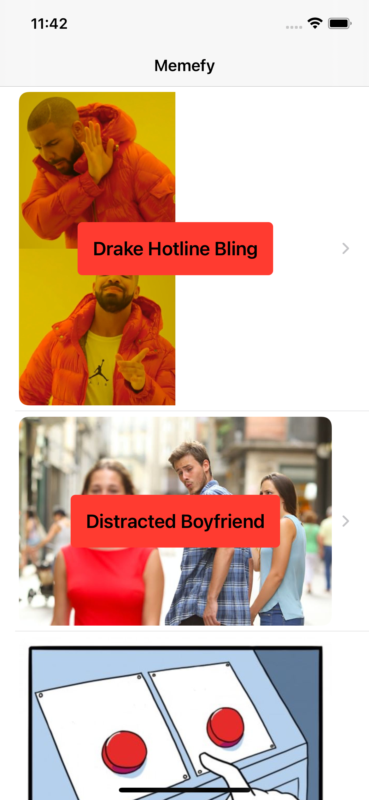
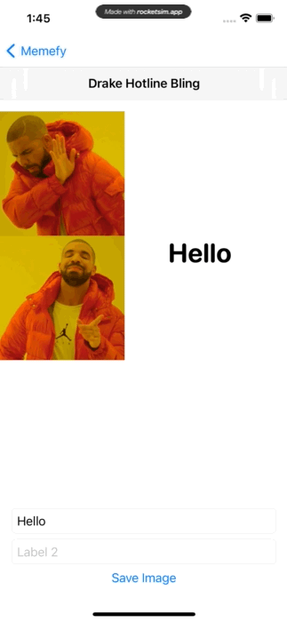

# Memefy App
SwiftUI, a meme creator app follow the courses by [Rebeloper](https://www.youtube.com/channel/UCK88iDIf2V6w68WvC-k7jcg), with extra feature added myself like HUD.

# Menu
* [Screenshots](#screenshots)
* [Features](#features)
* [To-Do](#to-do)
* [Source](#source)
* [Contributions](#contributions)
* [Contact](#contact)

# Screenshots

# Features

* Draggable Text

* Take Screenshot and crop the image needed

### To-Do
* Image successfully saved notification with HUD

# Source
This meme creator app follow the courses by [Rebeloper](https://www.youtube.com/channel/UCK88iDIf2V6w68WvC-k7jcg), fully developed with SwiftUI.

### API

[Imgflip](https://imgflip.com/api)

### Library used

[KingFisher](https://github.com/onevcat/Kingfisher)

# Contributions

* All kinds of contributions (enhancements, new features, documentation & code improvements, issues & bugs reporting & todo task) are welcome. Let's make it better.

# Contact
Created by [Terry Kuo](https://twitter.com/ArgonYoYo) - feel free to contact me!
